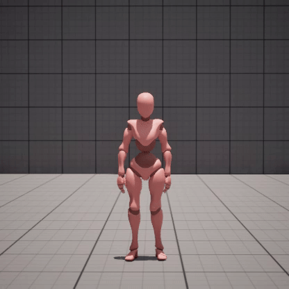
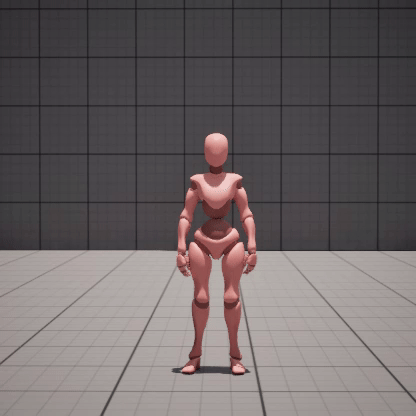
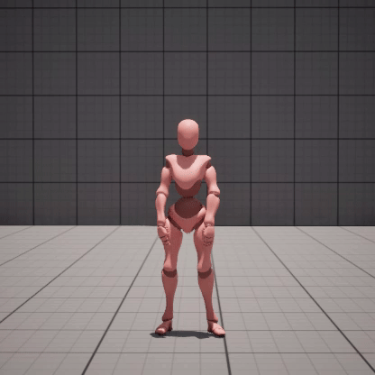
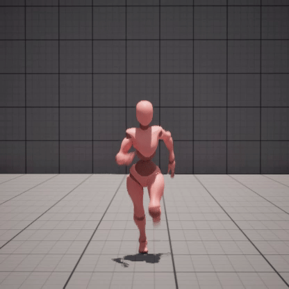

# 678 Project: UE5-Distress-Action-Detection

## Overview

This project is focused on distress-related action recognition in a variety of environmental and weather conditions.
We automate the generation of synthetic video data using Unreal Engine 5 (UE5) and UnrealCV, performing simulations of six distress-related
human actions: injured waving, jumping, pointing, injured walked(limping), running, and holding something in pain.

We pass this data through a convolutional neural network (CNN) to perform feature extraction, and follow this up by utilising 
a Long Short-Term Memory (LSTM) network to analyze patterns within the time series data. We utilize fully connected layers to
then map our learned representations to one of the six distress-related actions, which we may use for action classification.

## Dataset Composition

### Dataset: [Google Drive Link](https://drive.google.com/drive/folders/1cNK0zNhGn7se6q93vj9lQyrUQG_6PUY1?usp=sharing)

### Mixamo Actions: 

| Waving              | Jumping             | Pointing            |
|:-------------------:|:-------------------:|:-------------------:|
| <div align="center"></div> | <div align="center"></div> | <div align="center"></div> |
| Injured Walking     | Running             | Holding something in pain |
| <div align="center"></div> | <div align="center"></div> | <div align="center"></div> |

### Camera Profiles:
- Front view
- Side view
  - Left
  - Right
- Top-down view

### Lighting Conditions:
- Day
- Night

## Backgrounds:
- Neutral(plain) environment
- Grassy/Rural environment
- City environment

### File Structure:

```
dataset/
├── holding_something_in_pain/
│   ├── holding_something_in_pain_day_rural_right_30fps.mp4
│   ├── holding_something_in_pain_night_grassy_back_30fps.mp4
│   ...
├── jumping/
│   ├── jumping_day_grassy_front_30fps.mp4
│   ...
├── injured_walking/
│   ├── injured_walking_night_plain_left_30fps.mp4
│   ...
...
```

## Model Architecture

The model architecture combines convolutional neural networks (CNNs) 
and Long Short-Term Memory (LSTM) to classify our synthetic video data of distress-related actions.
Our data is of the form of 30fps video segments of animations in various environments and conditions.

We pass our data through CNN to extract spatial features from individual frames, which helps the model learn visual patterns.

We then utilise these learned features by passing them through an LSTM model, which are better equipped to handle the time
series data from videos, and can interpret the features across each time step.

Finally, we utilise a fully connected layer to then map our learned representations to each of the labels associated with
the six distress-related actions.


